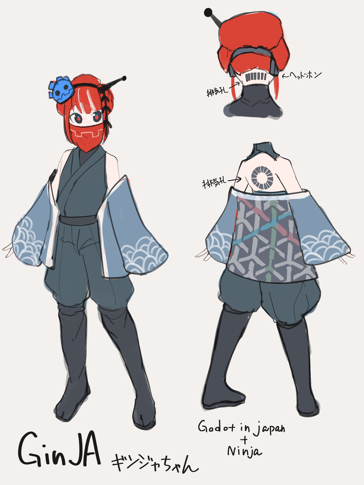
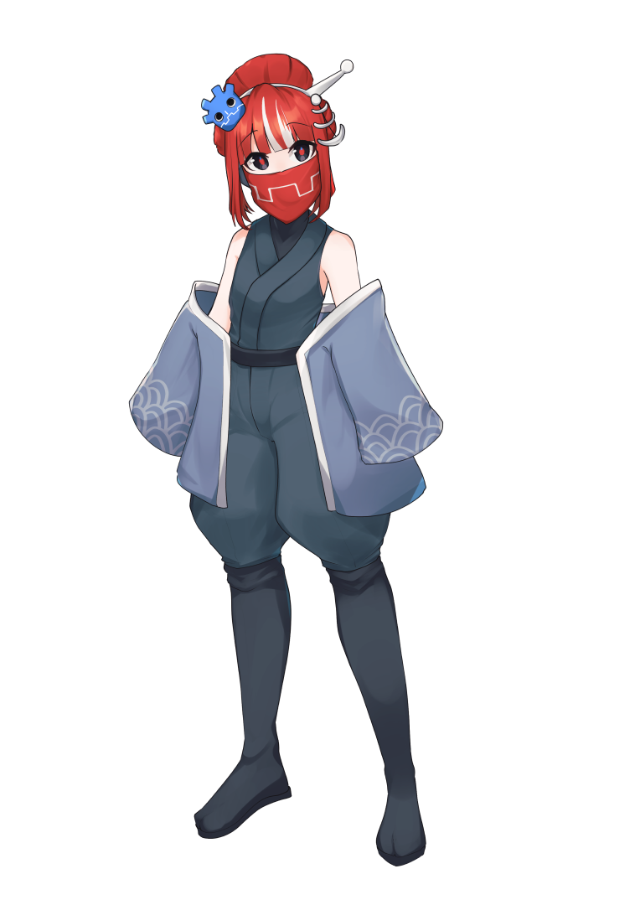

# GinJAプロジェクト
GinJAはGodot Japan User Communityの非公式キャラクターです。  
[CC BY 4.0](https://creativecommons.org/licenses/by/4.0/deed.ja)で提供されており、「SirakabaBiome」と表記すればライセンスの範囲内で自由に利用できます。

## 設定画

## 今後の予定
あくまで予定です
- 3Dモデルの提供
- 表情差分を含めた立ち絵の提供（png,psd両方）
- ドット絵・SD絵での歩行・走りスプライトの提供